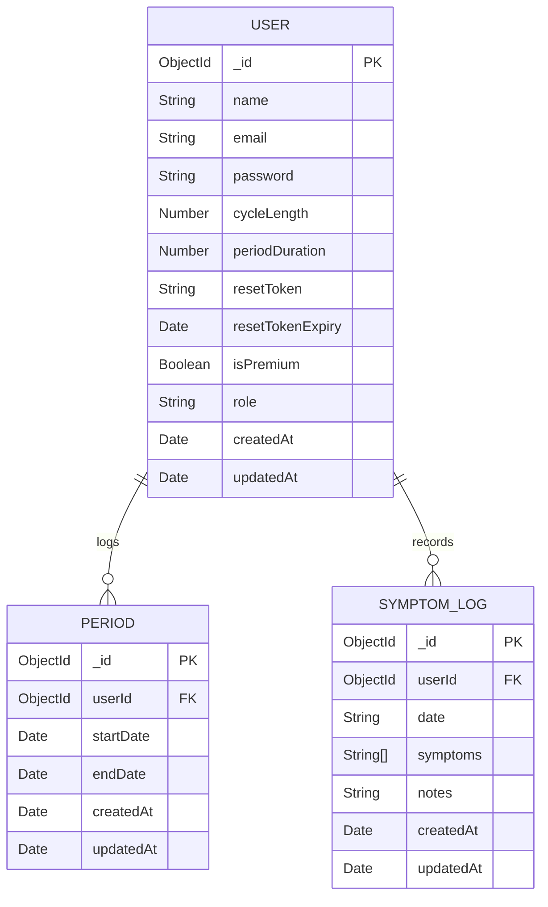
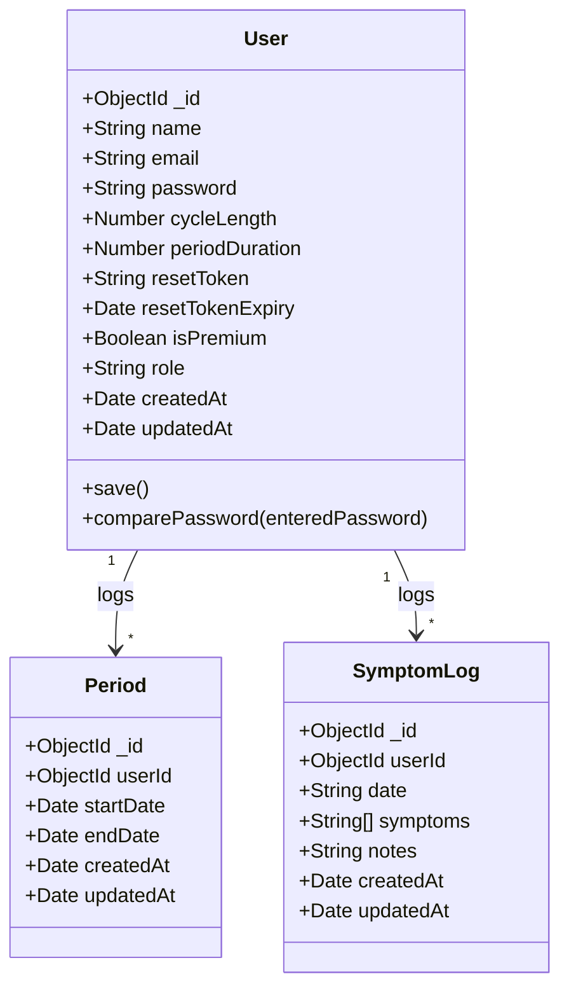
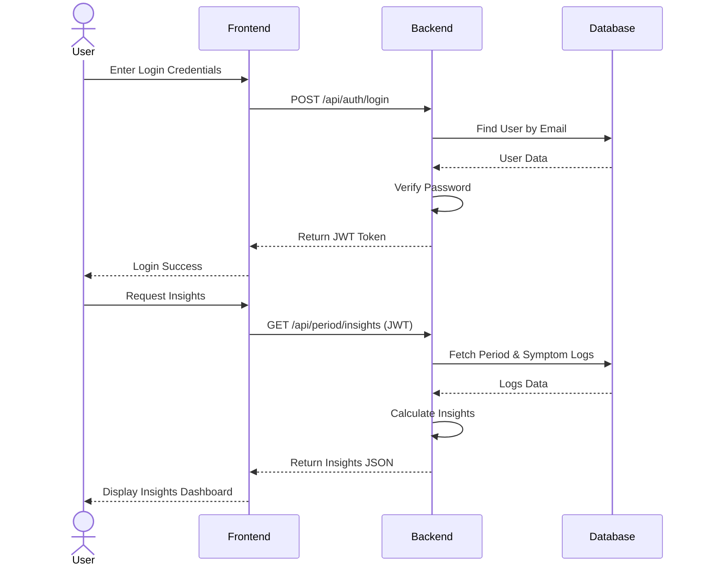

# Project Diagrams

## ER Diagram


## Class Diagram


## Use Case Diagram
```mermaid
usecaseDiagram
    actor User
    
    usecase "Register / Login" as UC1
    usecase "Log Period" as UC2
    usecase "View Period History" as UC3
    usecase "Predict Next Period" as UC4
    usecase "Log Symptoms" as UC5
    usecase "View Symptoms" as UC6
    usecase "Get Insights" as UC7
    
    User --> UC1
    User --> UC2
    User --> UC3
    User --> UC4
    User --> UC5
    User --> UC6
    User --> UC7
```

## Sequence Diagram (Login & Data Fetch)

